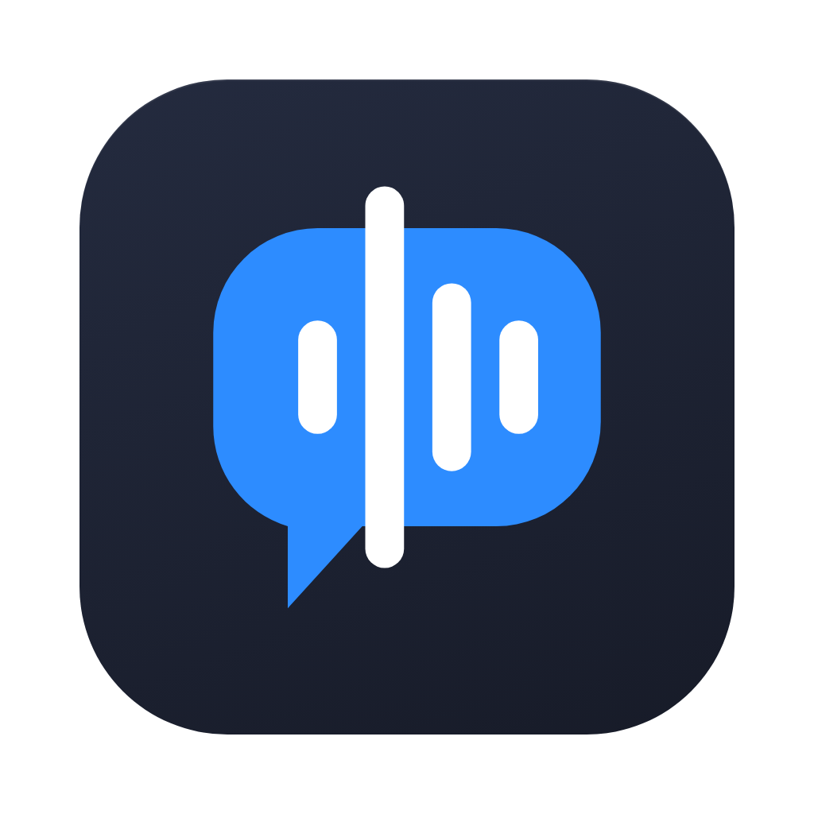
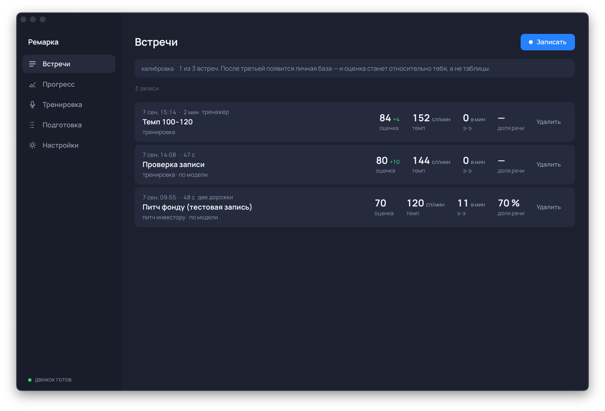
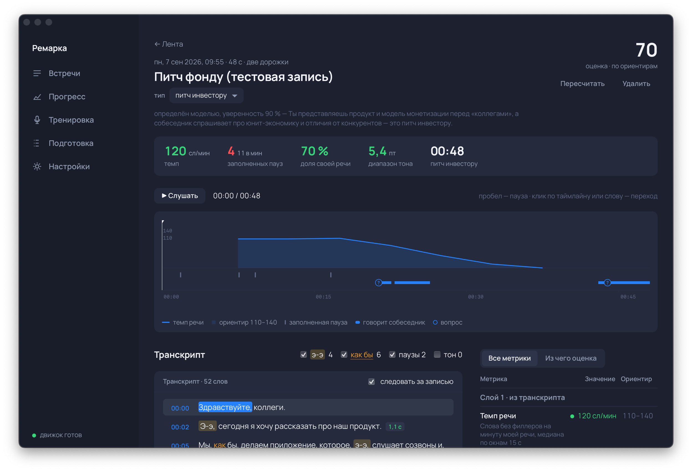

<p align="center">
  
</p>

<h1 align="center">Ремарка</h1>

<p align="center">
  Десктопное приложение, которое сидит рядом с Zoom, слушает, как ты говоришь на созвоне,<br>
  и после встречи объясняет, что с этим делать.
</p>

<p align="center">
  <em>Remarka — a macOS desktop app that records your side of a call, analyses speech tempo, filled pauses,
  prosody and structure locally (Whisper + Praat), then asks an LLM for three concrete fixes with verbatim quotes and timecodes.</em>
</p>





## Что делает

- **Пишет две дорожки**: микрофон и системный звук (собеседники) — без виртуальных драйверов, через Core Audio Process Taps. Поэтому не нужна диаризация: микрофон — всегда ты.
- **Считает метрики локально**, без облака: темп и артикуляционный темп, заполненные паузы («э‑э», «м‑м»), слова‑костыли, структурные и хезитационные паузы, доля своей речи, перебивания, длина предложений, лексическое разнообразие; из сигнала — диапазон тона, затухание концов фраз, восходящие утверждения, джиттер и шиммер, профиль громкости.
- **Ловит то, что Whisper стирает.** Whisper вычищает «э‑э» из транскрипта, поэтому рядом работает собственный детектор заполненных пауз по сигналу: VAD видит речь, распознавание не даёт слов, тон ровный — значит, это филлер.
- **Объясняет, а не измеряет.** Языковая модель получает уже посчитанные числа и транскрипт с таймкодами и отвечает на то, что арифметике недоступно: держалась ли структура, ответил ли ты на вопрос собеседника, какие три вещи поправить в первую очередь. Каждая рекомендация обязана содержать дословную цитату — иначе она не показывается.
- **Понимает тип встречи** (питч, демо, продажи, собеседование, стендап, лекция, 1:1, тренировка) и меняет ориентиры под него: один и тот же темп хорош для демо и плох для лекции.
- **Калибруется под тебя**: первые три встречи становятся личной базой, дальше сравнение идёт с тобой, а не с таблицей.
- **Знает, с кем работает**: профиль — имя, чем занимаешься, о чём встречи и что хочешь улучшить в первую очередь — и три правки после каждой встречи строятся вокруг твоей цели.
- **Тренировочный режим без Zoom**: задание на 60–120 секунд, живой темп на экране, автостоп, разбор как после настоящей встречи.
- **Помнит паттерны между встречами**: недельная сводка и упражнения под конкретно твою слабую сторону.

## Как устроено

```
Tauri 2 (Rust)                       Python‑движок                         Слой смысла
├─ трей, окна, оверлей записи         ├─ Silero VAD                         ├─ claude CLI (подписка)
├─ cpal: микрофон → 16 кГц WAV        ├─ faster‑whisper по кускам речи      ├─ Anthropic API (ключ)
├─ Swift‑сайдкар: системный звук      ├─ детектор филлеров по сигналу       └─ …или через SSH на свой сервер
├─ SQLite, очередь анализа            ├─ Parselmouth (Praat): просодия
└─ React 19 + Vite интерфейс          ├─ метрики → детерминированный JSON
                                      └─ оценка 0–100, калибровка
```

Порядок принципиален: сначала считаются проверяемые метрики, и только потом модель получает числа вместе с текстом. Аудио никогда не покидает компьютер; наружу уходит только текст, и только если слой смысла включён.

Подробные контракты между частями — в [docs/CONTRACTS.md](docs/CONTRACTS.md), продуктовый план — в [docs/plan.html](docs/plan.html).

## Стек

Rust · Tauri 2 · cpal · hound · rusqlite · Swift 6 (Core Audio Process Taps) · Python 3.11 · faster‑whisper · Parselmouth · numpy · React 19 · TypeScript · Vite.

## Установка

Готовое приложение для macOS 14.4+ (Apple Silicon) — в [Releases](https://github.com/cortexgod/remarka/releases): скачать `.dmg`, перетащить «Ремарку» в «Программы», открыть. Движок анализа уже внутри; при первом запуске приложение предложит скачать модель распознавания речи (один раз, ~1,6 ГБ), дальше всё считается на компьютере без интернета.

Советы, конспект и разбор ответов пишет модель Claude — ей уходит только текст. В настройках это подключается одним выбором: через Claude Code на компьютере, через ключ Anthropic, либо не подключать и смотреть только цифры.

## Запуск из исходников

Требования: macOS 14.4+, Node 20+, Rust stable, [uv](https://docs.astral.sh/uv/), Xcode Command Line Tools (Swift 6).

```bash
git clone https://github.com/cortexgod/remarka.git && cd remarka
npm install
cd engine && uv sync && cd ..        # Python 3.11, faster‑whisper, parselmouth
tap/build.sh                          # Swift‑сайдкар для системного звука
npm run tauri dev
```

Сборка приложения: `engine/build-sidecar.sh` (упаковывает движок в `engine/dist/remarka-engine`, PyInstaller), затем `npm run tauri build` → `src-tauri/target/release/bundle/macos/Remarka.app` и `.dmg`. Движок из `engine-dist/` внутри бандла используется автоматически; в dev‑сборке — `engine/.venv`.

Если Claude Code авторизован на твоём сервере, в «Дополнительно» можно указать путь к `scripts/claude-ssh` — тогда модель вызывается по SSH (см. `scripts/remarka-claude.server`).

## Проверки

```bash
cd engine && REMARKA_RUN_SLOW=1 .venv/bin/python -m pytest -q   # движок, включая прогон реальной модели
cd src-tauri && cargo test                                        # оболочка
npm run build && npm run check:mock                               # интерфейс, валидность отчётов по схеме
```

## Структура

```
engine/       Python‑движок: VAD, ASR, детектор филлеров, просодия, метрики, оценка, слой смысла
src-tauri/    Rust: захват звука, очередь анализа, SQLite, трей, уведомления
tap/          Swift: захват системного звука через Core Audio Process Taps
src/          React: лента, разбор с кликабельным таймлайном и транскриптом, прогресс, тренировка, подготовка, настройки
docs/         контракты, JSON‑схемы отчёта, продуктовый план
scripts/      SSH‑обёртка для слоя смысла на своём сервере
```

## Статус и ограничения

- Проверено на macOS 15 (Apple Silicon): живая запись, разбор, слой смысла через SSH. Windows‑ветка захвата (WASAPI loopback) написана, но не собиралась.
- Whisper `large-v3-turbo` на CPU M3 разбирает 47 секунд речи за ~36 секунд; часовой созвон — порядка 40–50 минут. На GPU быстрее.
- Запись собеседников в ряде юрисдикций требует согласия всех сторон, поэтому системный звук по умолчанию выключен.
- Движок упакован в приложение (PyInstaller, ~300 МБ), сборка не подписана: при первом открытии macOS может попросить подтвердить запуск в «Системных настройках → Конфиденциальность и безопасность».

## Лицензия

MIT.
